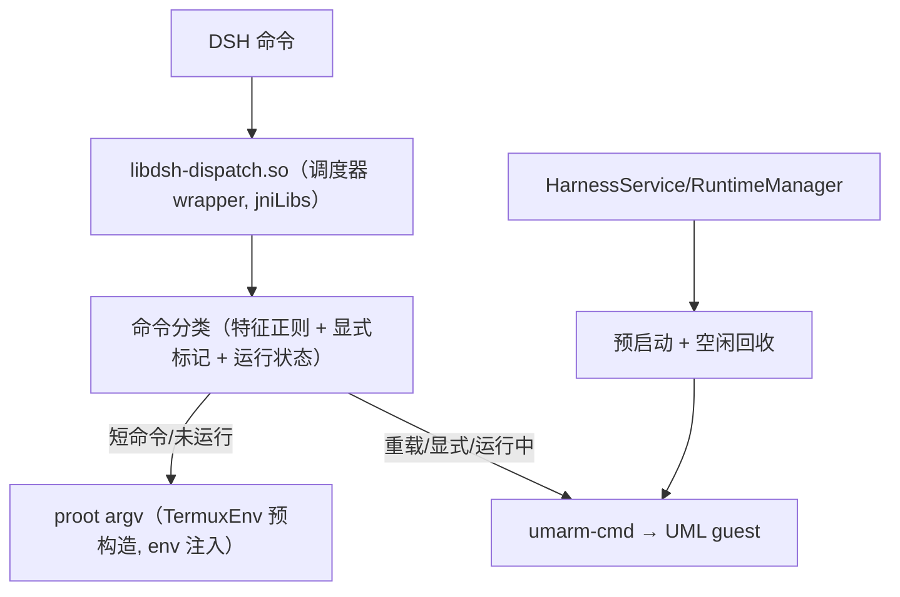

# 混合引擎调度器设计

Feature Name: hybrid-dispatch
Updated: 2026-10-03

## Architecture

## 调度器（libdsh-dispatch.so，shell 脚本）

路由决策按优先级：
1. 显式标记：命令含 `DSH_ENGINE=UML` 环境变量或 `UML: ` 前缀 → UML。
2. 运行中粘性：`$SHARE/dispatch.last` 时间戳距今 < 5 分钟 → 继续走 UML（消乒乓）。
3. 重载特征正则（长任务/编译/构建/安装）：`gcc|g\+\+|make|cmake|cargo|gradle|javac|go (build|run)|npm|pnpm|yarn|pip3? install|apt(-get)? (install|update)|tar -x|unzip |wget |curl -[LO]|dd |python3? .*-m pip` → UML（缺失时输出慢速提示一次）。
4. 默认（短命令/轻量）→ proot。
5. 降级：proot CMD 缺失 → exec 原生 bash（命令通道不能失效）。

UML 路由后 touch `$SHARE/dispatch.last`（粘性 + 空闲回收数据源）。

## 接口

- `TermuxEnv`：
  - `subsystemArgvJson()`：hybrid 引擎返回 `[libdsh-dispatch.so]`。
  - `serverEnv()` 注入：`DSH_DISPATCH_PROOT_CMD`（预构造 proot 命令行，单引号转义，shell-ready）、`DSH_DISPATCH_UMARM_CMD`（umarm-cmd 绝对路径）、`DSH_UMARM_SHARE`、`DSH_DISPATCH_UML_READY`（UML 运行中为 1）。
  - `prootCmdLine()`：把 prootArgvJson 的 argv 序列化为 shell-ready 命令行（路径单引号转义）。
- `AppSettings`：新增 `SUBSYSTEM_ENGINE_HYBRID`（新默认值）。
- `SubsystemManager`：`maybePreboot()`（服务启动预启动 UML）、空闲回收协程（60s 检查 `dispatch.last`，> 5min 且运行中 → stopUml）、引擎切换/卸载时取消回收。
- 设置页：引擎选择新增「自动调度（推荐）」。

## 降级矩阵

| 状态 | 路由 |
|---|---|
| proot 可用 + UML 运行中 | 按分类表 |
| proot 可用 + UML 未运行 | 重载命令触发预启动 + 本次走 proot（提示） |
| proot 缺失 + UML 运行中 | 全部走 UML |
| 两者不可用 | 原生 bash |

## 已知限制

- 不做运行中迁移；分类表正则随 patch_runtime.js 数据侧可更新。
- 交互终端固定 proot。
