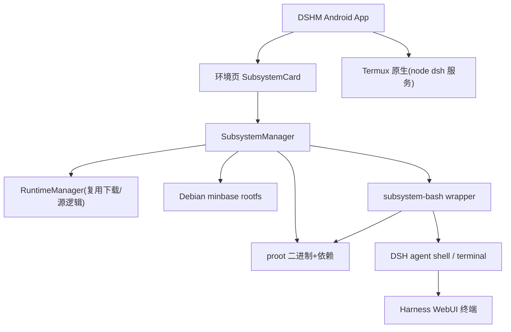

# Debian 子系统（proot 免 root）

Feature Name: linux-subsystem
Updated: 2026-08-16

## Description

为 DSHM 应用加载 Debian 子系统：通过 proot 免 root 运行 Debian minbase rootfs，为 DSH agent 提供完整可更新的工具链（apt、编译器、Python 等），并支持用户进入子系统交互式终端。DSH 核心服务（node web 服务）保持运行在 Termux 原生环境以保证性能。

核心约束（用户确认）：Debian minbase（体积小）；用途为 DSH agent 工具链 + 用户终端；node 服务不迁入子系统。

概念验证结论（2026-08-16，x86_64 环境）：
- proot 免 root 运行 Debian bookworm minbase 成功，apt update/安装/工具链执行正常
- rootfs：minbase 解压 206MB；装 python3+git+curl 后 509MB（工具按需安装，占用可控）
- 性能：proot 冷启动约 2~3ms/次（100 次 /bin/true 0.24s vs 原生 0.06s），基本命令无感；文件密集/编译任务有 ptrace 拦截开销，功能完整

## Architecture



说明：node 服务走 Termux 原生（性能关键路径）；agent 的 shell/sandbox 命令经 `subsystem-bash` wrapper 在子系统内执行；用户终端复用 DSH terminal API（WebUI 终端），其 bash 同样指向 wrapper。

## Components and Interfaces

### 1. 资产发布（构建侧）

新 release tag `debian-subsystem`（与 `runtime-latest` 并列），CI 构建时同步产出：

- `proot-aarch64.tar.gz`：proot 二进制 + 依赖共享库（libtalloc 等），解压至 `$SUBSYS/usr/bin`、`$SUBSYS/usr/lib`
- `debian-minbase-aarch64.tar.gz`：Debian bookworm minbase rootfs（预期下载 ~90MB，解压 ~200MB）
- `metadata.json`：`{version, url, sha256, sizeBytes, mirrors, builtAt}`

构建方法（CI runner，与现有 runtime 构建一致的交叉流程）：
- proot：从 termux-packages 源码交叉编译 aarch64（proot + libtalloc），或用 termux apt 仓库的 .deb 解包
- rootfs：`debootstrap --foreign --arch=arm64 --variant=minbase bookworm` + `qemu-user-static`（binfmt）完成第二段安装，再打包 tar.gz

### 2. SubsystemManager（应用侧）

Kotlin `object`（复用 RuntimeManager 的下载/进度/速度/校验机制与下载源前缀逻辑）。

接口：
- `state: StateFlow<SubsystemState>`：`{phase, progress, speedBytesPerSec, message, installed, version, running, installedBytes}`
- `attach(context)`：初始化与安装状态探测
- `installSubsystem()`：下载 proot + rootfs → 校验 sha256 → 解压
- `startSubsystem()` / `stopSubsystem()`：启动/停止 proot 进程
- `uninstallSubsystem()`：删除子系统目录（保留 Termux 运行时）
- `subsystemSize()`：占用空间统计（环境页存储卡展示）
- `effectiveAssetUrl(context, baseUrl)`：按当前下载源给资产 URL 加 GHProxy 前缀

存储布局（`$SUBSYS = File(context.filesDir, "subsystem")`）：
- `$SUBSYS/usr/bin/proot`、`$SUBSYS/usr/lib/…`：proot 及其依赖
- `$SUBSYS/rootfs/`：Debian rootfs
- `$SUBSYS/subsystem-bash`：wrapper 脚本
- `$SUBSYS/resolv.conf`：子系统专用 DNS 配置

### 3. subsystem-bash wrapper（DSH shell 集成）

关键集成点：DSH 的 shell 命令通过 bash 执行。现有 patch_runtime.js 的 Patch 7/8 已把 `bash-local`/`bash-sandbox` 的 bash 指向 `DSH_BASH_PATH`（nativeLibraryDir 的 libbash.so）。

默认策略（用户确认）：**安装子系统后 agent shell 自动走子系统，提供设置开关可切回 Termux 原生**。AppSettings 新增 `subsystemShellEnabled`（默认 true），wrapper 据此决定是否走 proot。

扩展：新增 `subsystem-bash` wrapper（shell 脚本），DSH_BASH_PATH 指向它：

```bash
#!/bin/sh
# 开关关闭、未安装子系统或 proot 不可用 → 回退 Termux 原生 bash
if [ "$DSH_SUBSYSTEM_ENABLED" != "1" ] || [ ! -x "$SUBSYS/usr/bin/proot" ] || [ ! -d "$SUBSYS/rootfs/etc" ]; then
  exec "$TERMUX_BASH" "$@"
fi
# proot 挂载根文件系统与必要绑定后执行 bash
exec "$SUBSYS/usr/bin/proot" \
  -0 -r "$SUBSYS/rootfs" \
  -b /dev -b /dev/pts -b /proc -b /sys \
  -b "$SUBSYS/resolv.conf":/etc/resolv.conf \
  -b "$TERMUX_PREFIX/tmp":/tmp \
  -b "$DSH_HOME":/root/dsh \
  -b "$DSH_WORKSPACE":/workspace \
  /bin/bash "$@"
```

- patch_runtime.js 新增 Patch：`bash-local`、`bash-sandbox`、`terminal-bash` 的 bash 路径指向 wrapper（写入 `DSH_SUBSYSTEM_BASH` 环境变量）；同时保留原生 bash 绝对路径（wrapper 回退用）
- TermuxEnv.serverEnv 注入：`DSH_SUBSYSTEM_BASH`、`DSH_SUBSYSTEM_ENABLED`、`SUBSYS`、`DSH_HOME`、`DSH_WORKSPACE` 等
- agent 的 shell、terminal 的 PTY 均经 wrapper 落到子系统；子系统内 `$HOME` 映射到 `$DSH_HOME`（凭证/会话数据沿用），workspace 绑定为 `/workspace`

### 4. 环境页 UI（SubsystemCard）

复用现有卡片模式（StorageCard/ProcessCard 风格）：
- 状态行：未安装 / 已安装（vX）/ 运行中
- 操作：拉取并安装 / 启动 / 停止 / 卸载 / 重装
- 进度卡：下载进度 + 实时速度（复用 RuntimeScreen 现有 `LinearProgressIndicator` + message 模式）
- 错误展示与日志：复用 LogDialog 查看启动/安装日志

### 5. DSH terminal 复用

DSH 内置 `terminal_open/list/read/send/signal/close`（持久 PTY 会话）与 `terminal-bash`。用户终端入口：环境页 SubsystemCard 提供"进入子系统终端"→ 通过 DSH 会话 API 在子系统内开 PTY → Harness WebUI 终端展示。无需自研 Android 终端视图。

## Data Models

```kotlin
enum class SubsystemPhase { NOT_INSTALLED, DOWNLOADING, EXTRACTING, RUNNING, ERROR }

data class SubsystemState(
    val phase: SubsystemPhase = SubsystemPhase.NOT_INSTALLED,
    val progress: Float = 0f,
    val speedBytesPerSec: Long = 0L,
    val message: String = "",
    val version: String? = null,
    val running: Boolean = false,
    val installedBytes: Long = 0L,
)

data class SubsystemMeta(
    val version: String,
    val prootUrl: String,
    val rootfsUrl: String,
    val sha256: String,
    val sizeBytes: Long,
    val mirrors: List<String> = emptyList(),
)
```

## Correctness Properties

- 子系统进程与 DSH node 服务进程相互独立；`stopSubsystem()` 只终止 proot 进程树，不影响 node 服务。
- 卸载只删除 `$SUBSYS` 目录；Termux 运行时（`filesDir/usr`）、dsh-home、workspace 数据不受影响。
- 子系统未安装或设置开关关闭时，所有命令回退到 Termux 原生 bash，行为与当前版本一致（零侵入）。
- rootfs 校验失败/下载中断时不留下部分安装；重装前先清理残缺目录。
- 单实例：`installSubsystem` / `startSubsystem` 在运行中时重复触发被忽略。

## Error Handling

| 场景 | 处理 |
|------|------|
| 资产下载失败/校验失败 | 清理部分文件，展示失败原因与重试入口 |
| 存储空间不足 | 安装前检查剩余空间（低于 rootfs 解压大小 1.5 倍则阻止并提示） |
| proot 启动失败 | 展示 wrapper/proot 日志（LogDialog），提示重装子系统 |
| 子系统损坏（rootfs 缺关键目录） | 环境页提示"子系统异常，请重装" |
| apt 无网络 | 绑定 `resolv.conf`（内置 DNS 8.8.8.8/1.1.1.1 兜底），apt 走宿主网络 |

## Test Strategy

- **本机构建验证**（已做）：x86_64 debootstrap minbase + proot + apt 安装 python3/git/curl 全部通过；记录体积与启动耗时。
- **CI 产物验证**：aarch64 rootfs 解压完整性（`/bin/bash`、`/etc/debian_version` 存在）、proot 二进制 `file` 类型为 aarch64 可执行、依赖库存在。
- **真机验证**：安装子系统 → 环境页状态正确 → 进入 WebUI 终端执行 `apt-get update && apt install build-essential` → agent 发起 shell 命令验证在子系统内执行 → 卸载后验证回退 Termux bash。
- **回归**：子系统未安装场景下现有 DSH 流程不受影响（Termux 原生）。

## References

[^1]: (Website) - [PRoot](https://proot-me.github.io/)
[^2]: (Website) - [proot-distro（Termux 官方）](https://github.com/termux/proot-distro)
[^3]: (File) - [patch_runtime.js](../android/../runtime-builder/patch_runtime.js) - 现有 bash 路径注入（Patch 7/8）
[^4]: (File) - [RuntimeManager.kt](../../android/app/src/main/java/com/siliconleap/app/runtime/RuntimeManager.kt) - 下载/进度/速度/源复用
