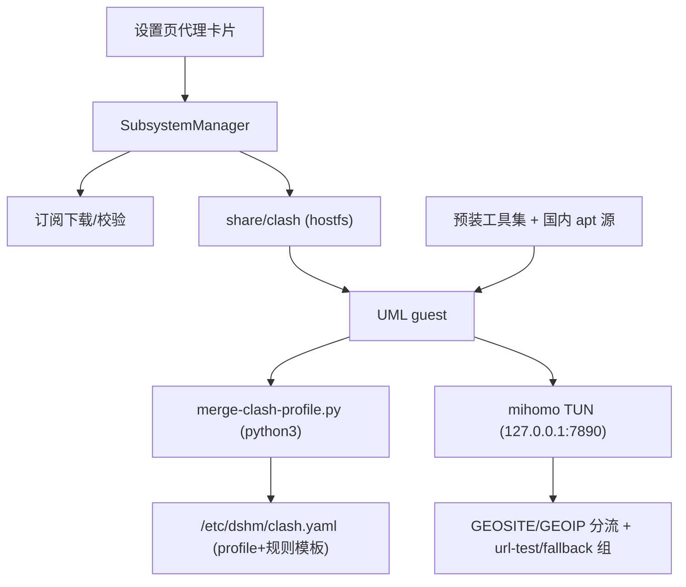

# 子系统预装工具集 + Clash（mihomo）代理设计

Feature Name: proxy-clash-subsystem
Updated: 2026-10-03

## Architecture

决策：mihomo 跑在 guest 内（UML 真内核 root，TUN 透明分流零特权）；GUI 由设置页承担（clash-verge-rev 的内核是 mihomo，Android 场景内嵌核心二进制）。

## 构建侧（build_umrootfs.sh）

1. Docker 镜像层解包后 `qemu-user-static + chroot apt install` 预装：
   - 基础：curl wget unzip ca-certificates tzdata
   - 开发：git python3 python3-pip openssh-client
   - 效率：jq ripgrep fd-find bash-completion
   - 网络：mihomo（release 二进制）/usr/local/bin + dnsutils
2. apt 源默认 TUNA（bookworm），Ubuntu 用 USTC。
3. 内置规则模板 `/etc/dshm/clash-rules.yaml`（GEOSITE CN 直连 + github 代理 + url-test 组 + fallback 兜底）。
4. `merge-clash-profile.py`（内置 /usr/local/bin）：python3 合并订阅 profile + 内置规则模板 + mode 覆盖，输出 `/etc/dshm/clash.yaml`。

## guest 侧（launcher）

- `umarm-init`：hostfs share 的 `clash/config.yaml` 存在且 `clash/enabled` 标记存在 → merge 脚本生成 /etc/dshm/clash.yaml → mihomo -d /etc/dshm -f clash.yaml 后台启动（TUN 模式）。
- `umarm-daemon.sh`：执行命令前 export http_proxy/https_proxy/all_proxy=http://127.0.0.1:7890（代理未运行时为无害兜底，直连不受影响）。

## 应用侧

- `AppSettings`：`proxyEnabled`（默认关）、`proxySubUrl`、`proxyMode`（rule/global/direct，默认 rule）、`proxyUpdatedAt`。
- `SubsystemManager`：`downloadClashProfile()`（下载订阅 → 校验 → 写 `share/clash/config.yaml` + enabled/mode 标记），复用下载逻辑；share 路径经 hostfs 对 guest 可见。
- 设置页「代理」卡片（子系统分区内）：开关 + 订阅输入 + 模式选择 + 状态/延迟显示（经 umarm-cmd 查询 `ip tuntap`/测速）。

## 安全边界

- 订阅含节点凭据：存 app 私有目录（share 下），上传时仅本地 hostfs，不出设备。
- mihomo 控制端口不暴露（external-controller 默认关闭）。
- TUN 依赖 CONFIG_TUN=y（uml-base.config 新增）。
