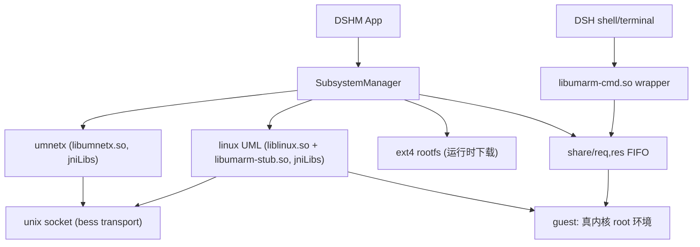

# UML 子系统引擎设计

Feature Name: uml-subsystem
Updated: 2026-10-03

## Architecture

## 构建侧（runtime-builder）

| 产物 | 脚本 | 说明 |
|---|---|---|
| `liblinux.so` + `libumarm-stub.so` | `build_uml.sh` | linux-um-arm64（um-arm64 分支，Linux 7.2-rc4 + 38 commits），NDK r27c bionic 静态构建；配置片段 `config/uml-base.config`（VECTOR/BLK_DEV_UBD/HOSTFS/SECCOMP）。stub 同样注入 jniLibs（stub_exe 需可执行路径） |
| `libumnetx.so` | `build_umnetx.sh` | 拉取 AAQWQ11/umnetx 单文件实现（仅 libc 依赖），NDK 交叉编译 |
| `umrootfs-aarch64.ext4` | `build_umrootfs.sh` | debootstrap --foreign + qemu-user-static 第二段安装，转 ext4；内置 umarm-init/umarm-daemon、vec0 静态网络配置 |
| `metadata.json` | 同上 | `{version, rootfsUrl, rootfsSha256, rootfsSizeBytes}`，发布 tag `uml-debian-subsystem` |

## 应用侧

- `AppSettings`：引擎新增 `SUBSYSTEM_ENGINE_UML`；`subsystemEngine` 校验接受 uml；`auto` = uml 优先。
- `SubsystemManager`：
  - 资产：`rootfsDir`（UML 下为 `$SUBSYS/rootfs.ext4` 单文件）、`shareDir`（`$SUBSYS/share`，含 req/res FIFO）、socket 路径 `filesDir/tmp/uml.sock`、`net.sock`。
  - `umlBin/stubBin/umnetxBin/umarmCmdBin`：jniLibs 路径。
  - `umlAvailable()`：liblinux.so + stub + umarm-cmd 均存在。
  - `startUml()`：umnetx 先行（`--listen net.sock`）→ UML `mem=512M ubd0=rootfs.ext4 root=/dev/ubda rw init=/umarm-init umarm.share=$SHARE stub_exe=… "vec0:transport=bess,src=uml.sock,dst=net.sock,mac=02:00:00:00:00:01" con=null con0=null,fd:1 panic=0 quiet`。
  - `stopUml()`：写 guest poweroff 请求 → 进程终止兜底 → 清理 socket。
  - `running` 状态进入 `SubsystemState`。
- `TermuxEnv.subsystemArgvJson()`：UML 分支返回 `[libumarm-cmd.so]`（未安装/未运行/内核缺失返回 null 回退 proot）；`assemblyArgv` 同理改走 umarm-cmd。

## 命令通道（umarm FIFO 协议）

- guest：umarm-init 挂 hostfs `$SHARE → /mnt/umarm`，启动 umarm-daemon：从 `req` 读一行命令（`\0` 结尾的原始块）→ `/bin/bash -c` → 输出（stdout+stderr）+ 结束标记 `__UMARM_DONE__` 写 `res`。
- host（libumarm-cmd.so 脚本，jniLibs 携带）：写 req → 读 res 直到结束标记 → 透传输出与退出码。
- 退出码：daemon 输出末尾 `__UMARM_RC__:<n>`，wrapper 解析后以自身 exit 传递。

## 网络参数

| 角色 | 地址 |
|---|---|
| guest | 10.0.2.15/24（vec0） |
| 网关 | 10.0.2.2 |
| DNS | 10.0.2.3 |
| 转发监听 | 127.0.0.1（默认，`--forward-bind any` 可开） |

## 已知限制

- UML 单处理器（无 SMP/cpuset）；无 32 位 compat。
- umnetx 仅 IPv4 / 无 DHCP / 单 guest。
- 内核 ~30-50MB 注入 jniLibs（CI 拉取 release 注入，仓库不提交大二进制）。
