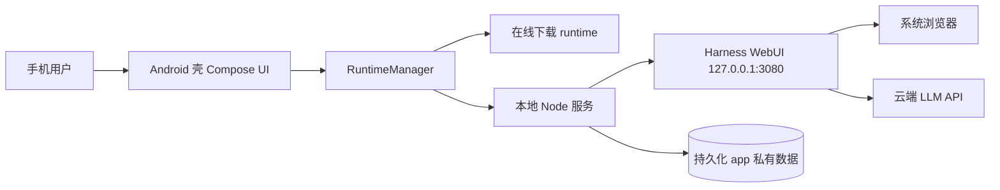

<div align="center">

<a href="https://github.com/RochelimitDawn/DSHM">
  
</a>

# DSHM

**Deepseek Harness Mobile**

DeepSeek Harness 的 Android 移动端封装：Miuix/KernelSU 风格原生 UI + Termux Linux 运行时，运行时在线下载安装，服务经系统浏览器使用，数据本地持久化。

[](https://github.com/RochelimitDawn/DSHM/stargazers)
[](https://github.com/RochelimitDawn/DSHM/network/members)
[](./LICENSE)
[](https://github.com/RochelimitDawn/DSHM/releases)


</div>

---

> ## ⚠️ 重要声明
>
> **DSHM 是 DeepSeek Harness 的第三方 Android 封装，并非 DeepSeek 官方产品，与 DeepSeek 及其关联公司无任何关系。**
>
> 本项目基于开源 [DeepSeek Harness](https://github.com/deepseek-ai/deepseek-harness)（`dsh`，MIT 协议）构建，仅将其 Web 能力封装为 Android 应用（原生 UI + 本地运行时 + 浏览器使用），不包含、不提供、也不代表 DeepSeek 官方模型或服务。DeepSeek、DeepSeek Harness 均为其各自权利人的商标。

---

## 产品定位

| 项 | 说明 |
| --- | --- |
| **主交付物** | 签名安卓 APK（内嵌 Termux Linux 运行时，运行时在线下载） |
| **代码结构** | Android 壳（Kotlin + Compose + Miuix）+ 在线下载的 `@deepseek-ai/dsh` 运行时 |
| **入口端口** | **3080**（本地服务，经系统浏览器打开 `127.0.0.1:3080`） |
| **LLM** | 云端 API（应用内不内嵌模型权重，Key 存于本地 `$DSH_HOME/.credentials.yaml`） |
| **当前发布版本** | `v2.1.30` |

> **使用方式**：安装 APK → 环境页「拉取并安装运行时」（在线下载约 500 MB，默认走 GHProxy AxisNow 三网优选，可在设置中切换 Cloudflare V4/V6 / GitHub / 自定义源）→ 打开应用自动启动服务 → 系统浏览器访问 Harness WebUI。运行时与服务数据全部持久化在应用私有目录。

```text
手机 APK
  ├─ Kotlin + Compose 壳（Miuix/KernelSU 风格 UI）
  ├─ Termux aarch64 Node / bash / rg（jniLibs）
  └─ 在线下载 runtime ──► filesDir/usr ──► node dsh web --port 3080
```

架构与细节见 **[docs/siliconleap-android.md](./docs/siliconleap-android.md)**。

---

## 核心能力

| 模块 | 能力 |
| --- | --- |
| KernelSU 风格 UI | 悬浮液态玻璃底栏 · 状态大卡 · 分组卡 · Miuix 组件深度对齐 |
| 黑白主题 | 白天 / 黑夜切换，与 Harness `settings.yaml` 双向同步，圆形扩散切换动画 |
| 在线运行时 | GHProxy AxisNow 三网优选（默认）· Cloudflare V4/V6 · GitHub · 自定义下载源 · sha256 校验 · 解压安装（进度卡 + 实时速度 + Shell 日志）· 版本与应用联动：应用升级携带新运行时版本时提示更新，纯应用升级保留现有运行时 |
| Debian 子系统 | 可选安装 Debian bookworm（proot 免 root，约 50 MB 下载）· agent Shell 切换子系统执行 · 完整 apt 工具链 · 一键卸载 |
| Root Shell | 可选：经 Magisk/KernelSU 授权后，agent 命令以真 root 在宿主 Android 执行（替换 proot，未授权自动回退） |
| 分区 UI | 三页面分区布局，清晰分组（手机 / 平板统一单栏流式） |
| 移动端 WebUI | dsh-mobile 插件自动装配，窄屏翻页器优化（桌面宽度不受影响） |
| 在线更新 | Release 检测 · Markdown 更新说明 · 覆盖安装，数据无缝保留 |
| 存储空间 | 运行时 / 工作区 / 会话 / 日志占用实时统计 |
| 前台服务 | 通知条常驻，可随时停止；打开应用自动启动（可关） |
| 系统浏览器 | 服务就绪后经系统浏览器使用 Harness WebUI，规避 WebView 兼容问题 |
| 全局字体 | 内置「Aa 古典刻北宋油墨版」字体，全 UI 应用 |

---

## 架构概览



| 层 | 路径 | 职责 |
| --- | --- | --- |
| 壳 | `android/app` | KernelSU 风格 UI、运行时管理、在线更新、主题 |
| 运行时装配 | `runtime-builder` | Termux bootstrap + nodejs + `@deepseek-ai/dsh` + 补丁 |
| CI | `.github/workflows/build-apk.yml` | 装配运行时、构建 APK、发布 runtime-latest 与 Release |

---

## 获取 APK

1. 打开 [Releases](https://github.com/RochelimitDawn/DSHM/releases) 下载最新 `app-release.apk`
2. 直接覆盖安装，应用会保留运行时、会话、凭据、工作区与配置数据
3. 安装后进入「环境」页拉取运行时，或让应用自动启动服务
4. 浏览器访问 `127.0.0.1:3080` 使用 Harness

当前仓库以 **`v2.1.30`** 作为发布版本，采用清理后的单一主线。

远程仓库策略：默认分支仅 **`main`**；发布版本使用 `v2.1.30` 标签，GitHub Release 仅保留当前交付版本与 `runtime-latest`（运行时下载源）。下载源默认 GHProxy AxisNow 三网优选，可在应用设置中切换 Cloudflare V4/V6 / GitHub / 自定义。

---

## 开发者联调（构建运行时 / APK）

### 环境

- Android SDK + JDK 17（打 APK）
- 运行时装配在 GitHub Actions 完成（大学镜像加速）

### 本地构建

```bash
# 1. 装配运行时
./runtime-builder/build_runtime.sh

# 2. 构建 APK
cd android
echo "sdk.dir=/path/to/android-sdk" > local.properties
./gradlew :app:assembleRelease
```

CI 工作流：[`.github/workflows/build-apk.yml`](./.github/workflows/build-apk.yml)

| Secret | 说明 |
| --- | --- |
| `SILICONLEAP_KEYSTORE_PATH` / `SILICONLEAP_KEYSTORE_PASS` | keystore 路径 / store 密码 |
| `SILICONLEAP_KEY_ALIAS` / `SILICONLEAP_KEY_PASS` | key alias / key 密码 |

---

## 目录结构

```text
DSHM/
|-- README.md
|-- LICENSE                       # GPL-3.0
|-- docs/
|   |-- siliconleap-android.md    # 移动端架构与设计
|   |-- brand/                    # logo（DeepSeek 横幅）
|   `-- ...
|-- android/                      # Android 壳（Kotlin + Compose + Miuix）
|   `-- app/src/main/
|       |-- res/font/             # 内置字体
|       |-- res/drawable/         # DeepSeek logo / banner vector
|       `-- java/com/siliconleap/app/
|           |-- ui/               # KernelSU 风格 UI、主题、更新
|           `-- runtime/          # 运行时管理、在线更新、设置
|-- runtime-builder/              # 运行时装配（CI 使用）
`-- .github/workflows/build-apk.yml
```

---

## 版本

| | |
| --- | --- |
| 产品 | **DSHM（Deepseek Harness Mobile）** |
| 版本 | `v2.1.30` |
| Release | **`v2.1.30`** |
| 运行时 | `@deepseek-ai/dsh`（在线下载，见 `runtime-latest`） |
| 下载源 | GHProxy AxisNow（默认）· GHProxy Cloudflare · GitHub · 自定义，可在设置页切换 |

---

## 致谢与版权说明

- 基于开源 [DeepSeek Harness](https://github.com/deepseek-ai/deepseek-harness)（`dsh`，MIT）构建，本项目的运行能力完全来自 dsh。
- 部分 UI 参考 [KernelSU Manager](https://github.com/tiann/KernelSU)（GPL-3.0）的 Miuix 布局与组件。
- 第三方子包若自带 MIT 等许可证，以包内文件为准。

---

## 许可证

本项目根目录采用 **[GPL-3.0](./LICENSE)**：

- 允许学习、研究、自用与分发（以协议全文为准）
- 请遵守 GPL-3.0 要求，保留版权与许可声明
- 第三方子包（`@deepseek-ai/dsh` 等）以各自许可证为准

```text
Required Notice: Copyright RochelimitDawn (https://github.com/RochelimitDawn/DSHM)
```

---

<div align="center">


**DSHM** · Deepseek Harness Mobile · 轻简随行，插件随心

</div>

---

## ✦ 联系我们 ✦

| 渠道 | 直达 |
|:---:|:---|
| 📬 硅基跃迁团队邮箱 | `SiliconLeap@163.com` |
| 💡 爱发电赞助入口 | [ifdian.net/a/Rochelimit](https://www.ifdian.net/a/Rochelimit) |

> 合作 · 反馈 · 支持，欢迎随时联络
