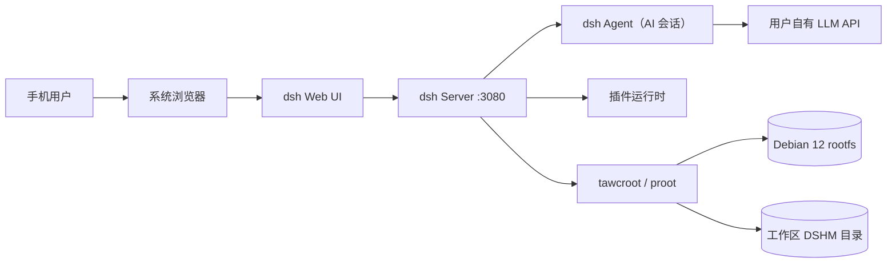

<div align="center">

<a href="https://github.com/RochelimitDawn/DSHM">
  
</a>

# DSHM

**Deepseek Harness Mobile**

*方寸之间，一条完整的 Linux 工具链。*

把完整的 Debian Linux 与 DeepSeek AI 编程助手装进 Android 手机——免 root、独立运行、全程本地。

[](https://github.com/RochelimitDawn/DSHM/releases)
[](https://github.com/RochelimitDawn/DSHM/stargazers)
[](./LICENSE)

[](https://github.com/RochelimitDawn/DSHM/releases)
[](#系统要求)
[](#核心能力)
[](#核心能力)
[](#架构概览)
[](#版本)

</div>

---

## 产品定位

| 项目 | 说明 |
|------|------|
| **主交付物** | 签名安卓 APK：本地内嵌 Debian 子系统 + AI 编程 Agent |
| **执行引擎** | tawcroot（seccomp 用户态通知，自研补丁）+ proot 兼容回退 |
| **子系统** | Debian 12 bookworm（真 bash / apt，工具链开箱即用） |
| **Agent** | DeepSeek dsh CLI（Node.js 编码 Agent，自带 Web UI） |
| **入口端口** | `3080`（Web UI · AI 会话 · 插件生态） |
| **LLM** | 云端 API（应用内配置用户自有 Key，壳内不含模型权重） |
| **数据边界** | 全程本地：子系统数据 fscrypt 加密，对话不出设备 |

> 仓库只维护 Android 主线。`runtime-builder/`（运行时、子系统镜像与执行引擎构建）是 APK 运行形态的必要组成部分，请勿当作可删的构建脚本拆除。

```
手机 APK
  ├─ Kotlin 壳（服务、装配、更新、通知）
  ├─ Termux 派生运行时（runtime.zip，约 580 MB，在线安装）
  ├─ Debian 12 子系统（debian-minbase.tar.gz，约 48 MB，在线安装）
  │     └─ tawcroot / proot ──► 真 bash · apt · node · python3 · git
  └─ dsh CLI + Web UI ──► 127.0.0.1:3080
```

架构与实现细节见 **[docs/siliconleap-android.md](./docs/siliconleap-android.md)**。

---

## 核心能力

| 模块 | 能力 |
|------|------|
| **tawcroot 执行引擎** | seccomp 用户态通知（systrap）拦截路径类 syscall，单进程原地翻译；路径操作快 2.5～7.5 倍（taw 项目 benchmark），apt 安装体感差距明显；老系统自动回退 proot |
| **Debian 子系统** | 完整 Debian 12 用户态：真 bash、真 apt，node / python3 / git / ripgrep 开箱即用；工作区即手机存储 `DSHM` 目录，与文件管理器双向互通 |
| **AI 编程会话** | DeepSeek dsh CLI：手机上直接让 AI 写代码、改项目、跑命令；终端、会话、项目管理全在浏览器 Web UI |
| **AI 自我排障** | 子系统日志全量落盘（`/root/dsh/logs/*`），AI 可直接读取日志定位装配与运行问题 |
| **插件生态** | 兼容插件以 npm tgz 分发，多源下载、自动装配与验证；内置插件市场、用量统计等扩展 |
| **国内网络优化** | apt 走 USTC、npm 走 npmmirror、GitHub 下载多镜像回退（GHProxy）——无梯子也能装齐环境 |
| **更新体系** | 应用内在线更新：运行时版本校验（sha256）、增量引导、更新总开关 |

---

## 架构概览


```mermaid
flowchart LR
  U["手机用户"] --> B["系统浏览器"]
  B --> W["dsh Web UI"]
  W --> S["dsh Server :3080"]
  S --> A["dsh Agent（AI 会话）"]
  S --> P["插件运行时"]
  A --> K["用户自有 LLM API"]
  S --> T["tawcroot / proot"]
  T --> R[("Debian 12 rootfs")]
  T --> WS[("工作区 DSHM 目录")]
```

| 层 | 路径 | 职责 |
|----|------|------|
| 壳 | `android/` | 前台服务、运行时/子系统下载装配、更新、通知、设置 |
| 运行时 | `runtime-builder/build_runtime.sh` | Termux 派生前缀：node 22、pnpm、dsh CLI 与补丁（runtime.zip） |
| 子系统 | `runtime-builder/build_subsystem.sh` | Debian 12 rootfs 与 proot 依赖（debian-subsystem release） |
| 引擎 | `runtime-builder/build_tawcroot.sh` | tawcroot 执行引擎（随 CI 打进 APK jniLibs） |
| Agent | `@deepseek-ai/dsh` | AI 会话、插件生态、Web UI（npm 分发，随运行时内置） |

---

## 获取 APK

1. 打开 [Releases](https://github.com/RochelimitDawn/DSHM/releases) 下载最新 `app-release.apk`
2. 直接覆盖安装，升级会保留子系统、工作区与配置数据
3. 首次启动按引导下载运行时镜像（约 580 MB，多源加速）并完成子系统初始化
4. 启动服务后，浏览器打开 Web UI；在应用内配置自有 DeepSeek API Key 即可开始

### 系统要求

| 项目 | 要求 |
|------|------|
| 架构 | arm64（arm64-v8a） |
| 系统 | Android 13+（minSdk 33） |
| 存储 | 2 GB 以上可用空间 |
| 网络 | 安装阶段需要网络（多源加速，国内可直连） |

> 安全说明：子系统数据落在应用私有目录（fscrypt 加密），执行全程免 root、用户态沙箱内完成，不修改系统分区。

---

## 从源码构建

### 环境

- JDK 17 + Android SDK，NDK 27.2（APK 构建）
- Linux x64 构建机（运行时/子系统镜像构建，需 `skopeo`、`e2fsprogs`、`qemu-user-static`）
- Node.js ≥ 22（补丁脚本）

### 构建命令

```bash
# APK（产物随 CI 发布，本地验证用）
cd android && ./gradlew assembleRelease

# 运行时镜像 runtime.zip（官方 Releases 已提供，自建可选）
cd runtime-builder && bash build_runtime.sh

# Debian 子系统镜像 + proot 依赖
cd runtime-builder && bash build_subsystem.sh

# tawcroot 执行引擎（CI 内打进 jniLibs）
cd runtime-builder && bash build_tawcroot.sh
```

| 脚本 | 产物 | 发布位置 |
|------|------|----------|
| `build_runtime.sh` | `runtime.zip` + `metadata.json` | `runtime-latest` release |
| `build_subsystem.sh` | `debian-minbase-aarch64.tar.gz` + `proot-aarch64.tar.gz` | `debian-subsystem` release |
| `build_tawcroot.sh` | `libtawcroot.so` 等 | APK jniLibs（CI 内置） |
| `build_apk.yml`（CI） | `app-release.apk` | 版本 release |

执行引擎源码在 `runtime-builder/vendor/tawcroot`（基于 [taw](https://github.com/wmww/tawc) 魔改，含本地补丁）。

### 目录结构

```
DSHM/
|-- README.md
|-- LICENSE                             # GPL-3.0
|-- docs/                               # 架构文档 · 品牌资产
|-- .github/workflows/build-apk.yml     # APK 构建 + release CI
|-- android/                            # Kotlin 壳（服务 · 装配 · 更新 · UI）
|   `-- app/src/main/java/com/siliconleap/app/
|       |-- runtime/                    # SubsystemManager · RuntimeManager · AddonManager ...
|       `-- ui/screens/                 # Compose 设置界面
`-- runtime-builder/                    # 运行时 · 子系统 · 引擎构建
    |-- build_runtime.sh                # Termux 派生运行时（node + dsh + 补丁）
    |-- build_subsystem.sh              # Debian rootfs + proot
    |-- build_tawcroot.sh               # tawcroot 执行引擎
    |-- patch_runtime.js                # 运行时补丁（随版本携带）
    `-- vendor/tawcroot/                # 引擎源码（含本地补丁）
```

---

## 版本

| 产品 | 说明 |
|------|------|
| **Release** | `v2.2.45`（正式版，无预发布标记） |
| 应用 | DSHM（Kotlin 壳，Compose UI） |
| 运行时 | `0.2.0-rc.2-r6`（r6：全部补丁随应用升级携带） |
| 子系统 | Debian 12 bookworm（aarch64） |
| Agent | DeepSeek dsh CLI 0.2.0-rc.2（Node.js） |

远程仓库策略：默认分支仅 `main`；正式发布使用 `v2.2.N` 标签，GitHub Release 保留当前交付版本与 APK。工作流：[`.github/workflows/build-apk.yml`](./.github/workflows/build-apk.yml)。

---

## 致谢

- [taw](https://github.com/wmww/tawc)（MIT）—— tawcroot 执行引擎基础
- [proot](https://proot-me.github.io/)—— 兼容回退执行引擎
- [Termux](https://termux.dev/)—— 运行时引导与工具链基础
- [Debian](https://www.debian.org/)—— 子系统根文件系统
- [DeepSeek dsh](https://www.npmjs.com/package/@deepseek-ai/dsh)—— AI 编程 Agent CLI
- [USTC / npmmirror / GHProxy](https://github.com/RochelimitDawn/DSHM)—— 国内镜像加速

---

## 赞助

https://afdian.com/a/Rochelimit

---

## 许可证

本项目采用 **[GPL-3.0](./LICENSE)**。

- 允许自由使用、修改与分发，衍生作品须以同协议开源（以协议全文为准）
- 第三方子包若自带 MIT 等许可证，以包内文件为准

```
Required Notice: Copyright RochelimitDawn (https://github.com/RochelimitDawn/DSHM)
```

---

<div align="center">

<a href="https://github.com/RochelimitDawn/DSHM">
  
</a>

**DSHM** · Deepseek Harness Mobile · 方寸之间，一条完整的 Linux 工具链

---

## ✦ 联系我们 ✦

| 渠道 | 直达 |
|------|------|
| 📬 硅基跃迁团队邮箱 | `SiliconLeap@163.com` |
| 💡 爱发电赞助入口 | [afdian.net/a/Rochelimit](https://afdian.com/a/Rochelimit) |

> 合作 · 反馈 · 支持，欢迎随时联络

</div>
