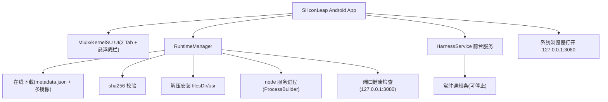

# DSHM（Deepseek Harness Mobile）· 移动端设计方案

> 目标：将 DeepSeek Harness（`dsh`）封装为「Miuix/KernelSU 风格原生 UI + Termux Linux 运行时 + 系统浏览器使用」的 Android 应用，运行时在线下载安装，数据本地持久化。
>
> 产品名：DSHM（Deepseek Harness Mobile，原名 SiliconLeap）
>
> 版本号：基础版本 `v2.N.E`（大版本升 `N`，小版本升 `E`），当前为 `v2.1.18`。

## 一、总体架构

### 关键决策

| 项 | 决策 | 原因 |
|---|---|---|
| WebView | **移除**，用系统浏览器 | WebView 视口/渲染兼容问题多轮未根治，dsh 是 Web 应用，浏览器体验最佳 |
| 运行时 | **在线下载**（GitHub Releases） | APK 仅含 native libs（~43MB），运行时（~539MB）按需下载 |
| UI | **复刻 KernelSU**（Miuix 0.9.3） | KernelSU 是 MIUI 风格 Miuix 应用标杆，深度对齐其布局与组件 |
| 服务 | 前台服务 + 通知条常驻 | 后台运行，通知条显示状态可停止 |
| 安装 | 打开应用**不自动下载**，环境页手动拉取 | 避免大流量意外消耗；已安装则按开关自动启动服务 |

## 二、UI 设计（复刻 KernelSU）

### 1. 主框架（MainScreen）

- `HorizontalPager` 三页滑动切换 + 底部导航栏
- 底部导航默认**悬浮液态玻璃胶囊**（iOS Liquid Glass 风格：lens 折射、内阴影、按压力度缩放、阻尼拖动），可关闭退回普通 Miuix `NavigationBar`
- 每页独立 `Scaffold` + `BlurredBar` 模糊 TopAppBar（大标题 + 滚动自适应 `MiuixScrollBehavior`）

### 2. 首页（Home）

- 状态大卡：运行中 → 绿色卡（`#DFFAE4`/深色 `#1A3825`）+ 右下大图标 + Tilt 反馈；未安装 → 提示拉取卡
- 信息卡：应用版本 / 运行时版本 / 服务状态 / 监听地址 / PID / 运行时长（实时刷新）
- 存储空间卡：运行时 / 工作区 / 会话与设置 / 日志 / 总占用（每 3s 刷新）
- 「打开 Harness / 启动服务」「了解项目」行卡（BasicComponent + Link 图标）
- 出错时顶部 `WarningCard`（Error/Notice 两级，动态色）

### 3. 环境页（Runtime）

- 分组卡（KernelSU 设置页风格）：运行时状态（含安装中进度与错误）、操作（拉取并安装 / 启动服务 / 卸载）、下载源

### 4. 设置页（Settings）

- 主题：白天 / 黑夜切换（与 Harness 双向同步）
- 服务：打开应用时自动启动服务（SwitchPreference）/ 服务端口 / 重启服务
- 数据：清空会话与设置数据 / 卸载运行时
- 关于：版本信息

> 悬浮底栏 + 液态玻璃模糊为**固定默认**（默认开启，不提供 UI 开关）。

### 5. 主题联动（Harness 双向同步）

- **主题源**：DeepSeek Harness 的 user-settings（`$DSH_HOME/settings.yaml` 的 `ui-theme.preference`，值为 `system` / `light` / `dark`）
- **跟随 Harness**：应用启动时读取该文件，应用 UI 与 Harness 使用同一主题源
- **同步刷新**：应用切换白天/黑夜时写回 `settings.yaml`（原子替换，保留其他配置），dsh 经 chokidar 热重载，浏览器刷新即应用新主题
- **切换动画**：点击切换按钮时，从按钮位置圆形扩散的遮罩过渡动画（`ThemeTransitionOverlay`）

### 5. 加载页（BootScreen）

- 安装/启动时以 **miuix `WindowDialog` 卡片**叠加在当前界面弹出（非全屏替换）
- 内容：阶段标题 + 状态文本 + `LinearProgressIndicator` 进度条 + 百分比 + **Shell 终端日志框**（三色圆点标题栏、深色背景、monospace 滚动日志）+ 复制日志 / 重试 / 关闭
- 日志由 `RuntimeManager` 写入 `logs/server.log`（下载源、进度、sha256、解压、node 输出）

## 三、数据目录与持久化

| 目录 | 用途 | 持久性 |
|---|---|---|
| `filesDir/usr` | Termux prefix（node、bash、rg、库），在线下载安装 | 只读运行时 |
| `filesDir/dsh` | `@deepseek-ai/dsh` 安装目录 | 只读运行时 |
| `filesDir/dsh-home` | `DSH_HOME`：profiles、sessions、settings、credentials | 持久 |
| `filesDir/workspace` | 默认工作区 | 持久 |
| `filesDir/home` | `HOME`（bash 历史、配置） | 持久 |
| `filesDir/logs` | 服务与安装日志（`server.log`） | 持久 |

- 凭据（`.credentials.yaml`）存于 `dsh-home` 应用私有目录，不导出、不进入 `process.env`
- 应用开关（自动启动）持久化于 `AppSettings`（SharedPreferences）；悬浮底栏 / 玻璃效果固定开启

## 四、运行时在线下载

- 元数据：`https://github.com/RochelimitDawn/DSHM/releases/download/runtime-latest/metadata.json`
- `metadata.json`：`version` / `url` / `sha256` / `sizeBytes` / `mirrors`（多镜像源兜底）
- 流程：获取元数据 → 多源下载（进度写入 state 与日志）→ sha256 校验 → 解压到 `filesDir/usr` → 标记安装
- 需要仓库**公开**才能匿名下载（v2.1.1 曾因私有仓库 404）

## 五、构建链（GitHub Actions）

- 触发：`push`（tags `v*`）与 `workflow_dispatch`
- **build-runtime**（ubuntu-latest）：大学镜像加速（清华 Termux / npmmirror / 中科大 Node），装配 `runtime.zip`，注入 native libs 到 jniLibs，发布 `runtime-latest` release 与 `metadata.json`
- **build-apk**：Android SDK + JDK，`./gradlew assembleRelease`，发布 APK 到 tag release
- 产物：`app-release.apk`（~43MB，仅 arm64）

## 六、版本与命名

- **产品名**：SiliconLeap（硅基跃迁）
- **版本规则**：基础版本 `v2.N.E`（大版本升 `N`，小版本升 `E`）
- **Android 映射**：`versionName = "v2.{N}.{E}[-preview]"`；`versionCode = 2000000 + N*10000 + E*100`
- 当前：`v2.1.18`（versionCode 2011800）

## 七、关键依赖

| 组件 | 版本 | 说明 |
|---|---|---|
| AGP / Kotlin / Compose | 9.2.1 / 2.4.0 / 1.12.0 | Gradle wrapper 9.5.1 |
| Miuix | 0.9.3 | `miuix-ui` / `miuix-icons` / `miuix-blur` / `miuix-preference` |
| material-icons-extended | 1.7.8 | KernelSU 同款 rounded 图标 |
| compileSdk / targetSdk | 37 | `platforms;android-37.0` |
| minSdk | 33 | arm64-only（miuix-blur 要求 Android 13+） |

## 八、在线更新

- **来源**：GitHub Release 最新版（`api.github.com/repos/RochelimitDawn/DSHM/releases/latest`）
- **版本对比**：解析 tag `v2.N.E` → `versionCode`（公式与构建一致），与本地对比
- **更新流程**：下载 `app-release.apk`（进度条）→ `FileProvider` + 系统安装器安装
- **无缝切换**：仅替换 APK，`filesDir`（运行时 / 工作区 / 会话）完全保留，数据不丢失
- **更新说明**：解析 GitHub Release 的 `body`，经 commonmark 解析后用 `MarkdownText` 组件渲染（标题/列表/粗体/代码块/引用等）
- **设置**：自动检测更新开关（默认开，启动时后台检查）+ 手动「检查更新」
- **发现更新**：设置页弹窗提示新版本、大小、Markdown 更新说明与数据保留说明

## 九、验证方式

- CI：编译期验证 Kotlin/Compose/Miuix 代码与 Gradle 构建通过
- 真机：安装 APK → 环境页拉取运行时 → 卡片显示进度/日志 → 自动启动 → 系统浏览器打开 Harness → 配置 Key → 会话持久化
