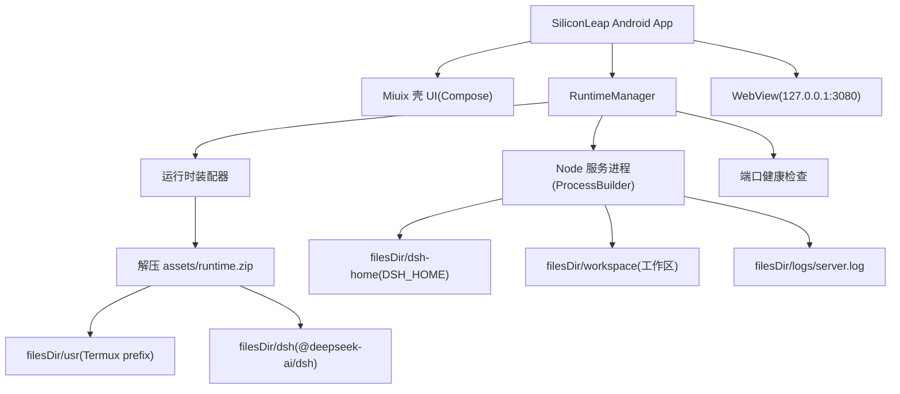
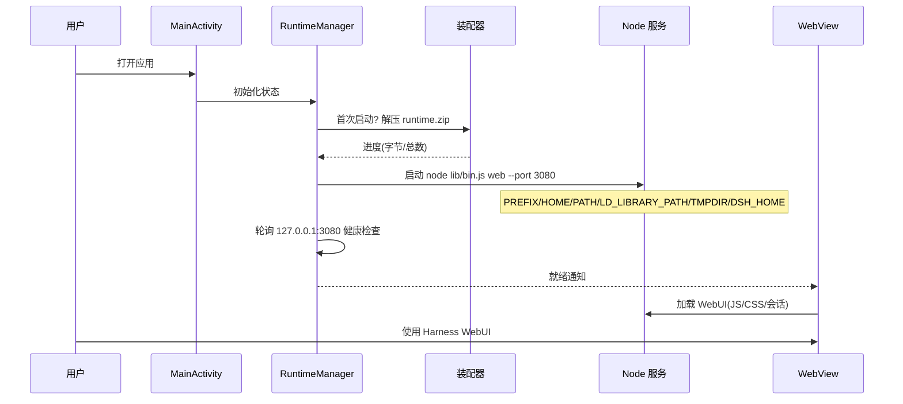

# SiliconLeap 硅基跃迁 · 移动端设计方案

> 目标：将 DeepSeek Harness（`dsh`）封装为「原生 Android WebView 壳 + Termux Linux 运行时」的 Android 应用，经 GitHub Actions 打包为 APK，实现安装即用（即装即用）、数据本地持久化。
>
> 产品名：SiliconLeap（硅基跃迁）
>
> 版本号：基础版本 `v2.N.E`（大版本升 `N`，小版本升 `E`），当前为 `v2.0.4`。

## 一、目标分析

### 1. 核心诉求

- **即装即用**：安装 APK 后无需用户手动安装 Termux / Node.js / 依赖，打开应用直接进入 DeepSeek Harness WebUI
- **运行时内置**：Termux Linux 运行环境（Node.js + bash + 工具链）随 APK 分发，首次启动自动解压
- **数据本地化**：会话、凭据、设置、工作区全部持久化在应用私有目录，重启不丢失
- **壳 UI**：原生 Android WebView 壳，使用 Miuix（Compose Multiplatform 的 MIUI 风格组件库）实现
- **CI 打包**：GitHub Actions 自动化产出 APK

### 2. 约束条件（调研结论）

| 约束 | 结论 | 影响 |
|---|---|---|
| Node.js 官方 Android 构建 | 现代版本（含 v22.19+，harness 要求 `^22.19 || >=24`）已**停发** Android 产物 | 必须使用 Termux 为 Android bionic 编译的 Node.js |
| `node-pty` 原生模块 | `dsh-subprocess-local` 顶层无条件 `import`（`packages/subprocess/subprocess-local/src/index.ts:15`），缺失则 bash 能力整体不可用 | 必须为 Android arm64 交叉编译，并提供懒加载降级补丁 |
| `@vscode/ripgrep` | 无 Android 平台产物，`tool-fs-search` 懒解析 rg 路径（`search-core.ts:156`） | grep/glob 工具需替换为 Termux `ripgrep` 二进制 |
| 服务地址 | `dsh web` 默认监听 `127.0.0.1:3080`，`--host 0.0.0.0` 被拒绝 | WebView 直连本机端口，天然不对外暴露 |
| Web 服务定位 | `dsh web` 是纯 HTTP 服务（非 Electron/浏览器），供浏览器/WebView 访问 | 适合 WebView 壳直接加载 |
| 凭据 | DeepSeek API Key 存于 `$DSH_HOME/.credentials.yaml`，不进入 `process.env` | 随 `DSH_HOME` 本地持久化 |

## 二、方案选型

### 1. 运行时方案对比

| 方案 | 说明 | 即装即用 | 可行性 | 结论 |
|---|---|---|---|---|
| A. Termux bootstrap 离线装配 | 提取 termux-app 的 bootstrap + 离线解析安装 nodejs/ripgrep 等 .deb，打包进 APK | 是 | 高（Termux 二进制用 `$ORIGIN/../lib` RPATH，可重定位） | **采用** |
| B. Node 官方 Android 构建 | 从 nodejs.org 取 `-android-arm64` 包 | 否 | 已停发 v22+ | 不可用 |
| C. 首次联网 `pkg install` | 首次启动在设备上联网装依赖 | 否 | 依赖网络 + 完整 Termux 安装器 | 不符合即装即用 |
| D. proot Debian rootfs | 内置 Debian arm64 + Node 官方 linux-arm64 | 是 | rootfs 巨大（>1GB）、PTY 在 Android 上有兼容风险 | 过重 |

### 2. 关键技术验证

- **Termux 可重定位（实测）**：Termux 二进制的动态库 RUNPATH 是**绝对路径**（`/data/data/com.termux/files/usr/lib`，全部 180 个二进制一致），并非 `$ORIGIN`。但 `LD_LIBRARY_PATH` 优先级高于 `DT_RUNPATH`，因此设置 `LD_LIBRARY_PATH=$PREFIX/lib` 即可让任意前缀下运行；bootstrap 内的符号链接记录在 `SYMLINKS.txt`（格式 `绝对链接路径←相对目标`），装配时重建为**相对符号链接**即可跨目录迁移
- **离线装配**：`apt` 解析器可用 Python 复刻——读取 Termux `Packages` 索引（`binary-aarch64/Packages`），沿 `Depends` 递归求解 nodejs/ripgrep 等包的依赖闭包，逐个下载 `.deb`（纯 tar 提取，无需模拟执行）
- **bootstrap 来源**：官方地址 `https://github.com/termux/termux-packages/releases/download/bootstrap-<ver>/bootstrap-aarch64.zip`（已实测下载并校验 SHA256 与 termux-app 官方一致）
- **node-pty 交叉编译**：Android NDK clang 交叉编译 N-API addon（Android bionic 无 `openpty`/`forkpty`，需 `posix_openpt` 兼容头）；同时给 `subprocess-local` 打懒加载补丁，编译失败时降级为无 PTY 模式，保证应用总能启动
- **Miuix 库**：`top.yukonga.miuix.kmp:miuix-ui:<version>`（0.9.2，依赖 CMP 1.11.1 / Kotlin 2.4.0），提供 `Scaffold`/`TopAppBar`/`NavigationBar`/`LinearProgressIndicator` 等 MIUI 风格组件，Android 工程用 `-android` artifact（其 CMP 依赖在 Android 上映射回 `androidx.compose.*`，可安全混用 Jetpack Compose）

### 3. 壳 UI 方案

- 纯 Android 工程（Kotlin + Jetpack Compose），引入 Miuix `-android` artifacts
- 单 Activity + Compose：`BootScreen`（WebView 渲染的启动页：terminal 壳 + checklist 加载动画，中英双语，联动 Web UI 明暗主题）→ `HomeScreen`（全屏 Harness WebView，无底部 Tab）
- WebView 嵌入 Compose（`AndroidView`），加载 `http://127.0.0.1:3080`
- 启动页由 `assets/boot/index.html` 呈现，阶段/进度/错误经 `AndroidBridge` JS 桥推送；明暗主题经 `ThemeStore`（SharedPreferences）与 Web UI 的 `data-ds-dark-theme` 双向联动

## 三、架构设计

### 1. 组件架构



### 2. 启动时序



### 3. 数据目录与持久化

| 目录 | 用途 | 持久性 |
|---|---|---|
| `filesDir/usr` | Termux prefix（node、bash、rg、库） | 只读运行时 |
| `filesDir/dsh` | `@deepseek-ai/dsh` 安装目录 | 只读运行时 |
| `filesDir/dsh-home` | `DSH_HOME`：profiles、sessions、settings、credentials | 持久 |
| `filesDir/workspace` | 默认工作区 | 持久 |
| `filesDir/home` | `HOME`（bash 历史、配置） | 持久 |
| `filesDir/logs` | 服务日志 | 持久 |

- 凭据（`.credentials.yaml`）存于 `dsh-home` 应用私有目录，不导出、不进入 `process.env`
- 会话持久化默认 JSONL（`dsh` 默认），重启可恢复会话历史

### 4. 目录结构

```text
/workspace
├── android/                          # Android 工程
│   ├── app/
│   │   ├── build.gradle.kts
│   │   └── src/main/
│   │       ├── AndroidManifest.xml
│   │       ├── assets/runtime.zip    # CI 注入的运行时（.gitignore）
│   │       ├── assets/boot/index.html # 启动页 WebView（terminal 壳 + checklist 加载动画）
│   │       ├── java/com/siliconleap/app/
│   │       │   ├── MainActivity.kt
│   │       │   ├── runtime/RuntimeManager.kt
│   │       │   ├── runtime/ThemeStore.kt # Web UI 明暗主题偏好持久化
│   │       │   ├── runtime/TermuxEnv.kt
│   │       │   ├── web/ServerWebView.kt
│   │       │   └── ui/...
│   │       └── res/...
│   ├── gradle/ (wrapper + libs.versions.toml)
│   └── build.gradle.kts / settings.gradle.kts / gradle.properties
├── runtime-builder/                  # 运行时装配（CI 使用）
│   ├── build_runtime.sh
│   ├── deps.py                       # Termux 依赖闭包求解
│   ├── patches/                      # node-pty / subprocess 懒加载 / ripgrep
│   └── launcher/run-dsh.sh
├── .github/workflows/build-apk.yml
└── docs/                             # 全部文档（本项目约定）
```

## 四、关键技术细节与踩坑规避

### 1. 运行时装配（CI）

- 下载 `termux-app` arm64 APK，`unzip` 取出 `assets/bootstrap-arm64.zip`，解压得最小用户环境（busybox、bash、apt 等）
- `deps.py` 从 Termux 仓库解析并下载依赖闭包（nodejs、ripgrep 及其依赖），`dpkg-deb -x`/`tar` 解压到 prefix
- `npm install @deepseek-ai/dsh`（宿主 x64 安装），随后替换原生位：
  - `node-pty`：NDK 交叉编译 `pty.node` 覆盖到 `node_modules/node-pty`
  - `@vscode/ripgrep`：补丁指向 Termux `rg` 二进制
- 打补丁（`subprocess-local` 懒加载 node-pty、`tool-fs-search` rg 路径）
- 产出 `runtime.zip`（`zip -0` 存储模式，配合 AAPT `noCompress "zip"`，APK 内不改压缩）

### 2. WebView 配置

- `usesCleartextTraffic` 按 `networkSecurityConfig` 白名单：仅允许 `127.0.0.1` / `localhost` 明文，其余强制 HTTPS
- `settings`：`javaScriptEnabled=true`、`domStorageEnabled=true`、`mixedContentMode=NEVER_ALLOW`
- 外部 URL 用系统浏览器打开；WebView 不暴露调试口

### 3. 进程生命周期

- Node 服务用 `ProcessBuilder` 启动，日志重定向到 `logs/server.log`
- `onDestroy` 优雅停止（`destroy()` + 兜底 `kill`）；Activity 重建（旋转/切后台）不重启服务，仅重连 WebView
- 启动后轮询 `http://127.0.0.1:3080`（超时 120s）判定就绪；失败展示错误与日志

### 4. 已知坑与规避

| 坑 | 规避 |
|---|---|
| Node 官方 Android 构建停发 | 用 Termux nodejs（bionic 编译） |
| Termux 二进制 RUNPATH 为绝对路径 | `LD_LIBRARY_PATH=$PREFIX/lib` 优先级高于 RUNPATH |
| bootstrap 符号链接丢失 | 按 `SYMLINKS.txt` 清单重建为相对链接 |
| CI 无法运行 arm64 bionic 二进制 | 不执行 apt，直接解包 `.deb` 组装 |
| bionic 无 `openpty` | node-pty 打 `posix_openpt` 补丁；失败时懒加载降级 |
| `@vscode/ripgrep` 无 android 产物 | 替换为 Termux ripgrep 并补丁路径 |
| `dsh-sandbox-windows-acl` 顶层 `koffi.struct` 读 `.size` 崩（`null.size`） | koffi stub 让 `struct("STARTUPINFOW"/"PROCESS_INFORMATION")` 返回带正确 `size`（104/24）的占位对象，通过顶层 ABI 断言；见 `patch_runtime.js` Patch 3 |
| `cordis-plugin-hmr` 报 `--expose-internals is required for HMR service` | `node-addon-require-builtin` 无 Android 产物，loader 取不到内部模块；node 启动加 `--expose-internals`（`RuntimeManager.startServer()` 与 `run-dsh.sh`） |
| WebView 明文请求被拦 | network_security_config 仅放行 127.0.0.1 |
| WebView 页面白屏 | 启动页与 Harness 页均开启 JS 控制台/网络错误诊断（logcat tag `SiliconLeapWeb`、`logs/webview.log`、`chrome://inspect`）；已确认根因：旧版 System WebView 缺 `Object.hasOwn`（Chrome 93+）等 API，dsh 前端初始化抛错白屏 |
| 旧 WebView 缺现代 API（`Object.hasOwn` 等） | `ServerWebView.shouldInterceptRequest` 拦截首页 HTML，在 `<!doctype html>` 后注入 polyfill（`Object.hasOwn`/`WeakRef`/`queueMicrotask`），保证页面脚本前生效 |
| APK 体积大 | `zip -0` + `noCompress`，仅 arm64，后续可上 split 与增量下载 |
| Android 系统杀后台进程 | 服务随 Activity 启动，文档提示驻留策略 |

## 五、版本与命名

- **产品名**：SiliconLeap（硅基跃迁）
- **版本规则**（需长期记忆）：基础版本 `v2.N.E`
  - `N`：大版本号，大版本升级时递增
  - `E`：小版本号，小版本/功能迭代时递增
  - 当前为 `v2.0.4`（大版本 N=0、小版本 E=4）
- **Android 映射**：`versionName = "v2.{N}.{E}[-preview]"`；`versionCode = 2000000 + N*10000 + E*100`（保证单调递增）

## 六、构建链（GitHub Actions）

- **Job 1 build-runtime**（ubuntu-latest）：装配运行时 → 上传 `runtime-android-arm64` artifact
- **Job 2 build-apk**（ubuntu-latest，依赖 Job1）：Android SDK + JDK17，显式安装 `platforms;android-37.0` + `build-tools;37.0.0`，注入 runtime 到 `assets/`，`./gradlew assembleRelease` → 上传 APK artifact
- 触发：`push`（tags `v*`）与 `workflow_dispatch`

### 已验证的本地工具链

| 组件 | 版本 | 说明 |
|---|---|---|
| Gradle | 9.5.1 | wrapper 锁定 |
| AGP | 9.2.1 | 内置 Kotlin（不应用 `kotlin-android` 插件） |
| Kotlin / Compose 编译器 | 2.4.0 | `org.jetbrains.kotlin.plugin.compose` |
| Miuix | 0.9.2 | `miuix-ui-android` / `miuix-icons-android` |
| compileSdk / targetSdk | 37 | 对应 `platforms;android-37.0` |
| minSdk | 26 | arm64-only |
| JDK | 21 | `android-actions/setup-android` + `setup-java` |

> 已在本机完成 `assembleDebug` 与 `assembleRelease` 真实编译验证（release 使用 debug 签名，Preview 阶段可安装）。

## 七、验证方式

- 本地（Linux x64）：`runtime-builder` 仅验证装配脚本逻辑（下载/解包/依赖求解），bionic 运行验证在真机/模拟器
- CI：编译期验证 Kotlin/Compose/Miuix 代码与 Gradle 构建通过
- 真机：安装 APK → 首次解压 → WebUI 打开 → 配置 DeepSeek Key → 会话持久化验证

## 八、风险与后续

- node-pty 在真机的最终验证是最大风险点（本环境无法运行 Android），已用懒加载降级兜底
- APK 体积较大（预计 150–300MB），后续可用应用内增量下载/多 APK 优化
- 仅支持 arm64（现代 Android 设备主流架构），后续按需补 armv7
