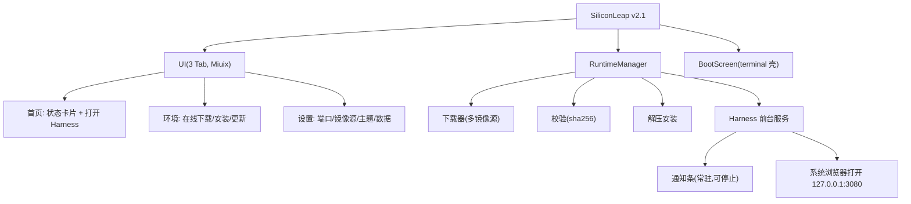

# SiliconLeap v2.1 重构方案：去 WebView + 在线运行时 + KernelSU 风格 UI

> 状态：**已实现（v2.1.0 ~ v2.1.3）**
> 版本：v2.1.3（N=1、E=3）
> 日期：2026-08-15

## 一、目标

1. **去除内嵌 WebView**：dsh 是 Web 应用，加载完成后用系统浏览器打开，规避 WebView 视口/渲染兼容问题
2. **运行时在线下载**：APK 不再内置 runtime.zip（体积 200MB → 约 10MB），首次进入从网络下载安装
3. **UI 参考 KernelSU**：底部 3 Tab（首页/环境/设置）+ 首页卡片布局，沿用 Miuix 组件
4. **服务通知条常驻**：Harness 服务以前台服务运行，通知条显示状态可停止
5. **保留启动页**：现有 terminal 壳（boot.html）作为安装/启动进度界面
6. **与 WebUI 联动**：主题、服务状态、版本信息联动

## 二、架构

## 三、镜像源策略

| 用途 | 源 | 说明 |
|---|---|---|
| CI 构建 Termux 包 | 清华 `mirrors.tuna.tsinghua.edu.cn/termux` | nodejs 等 .deb 加速 |
| CI 构建 npm | npmmirror | `registry.npmmirror.com` |
| CI 构建 Node（node-pty 编译） | 中科大 `mirrors.ustc.edu.cn/node` | 加速 |
| 应用下载 runtime.zip | GitHub Releases + ghproxy 加速 | 多源配置 |

## 四、UI 布局（参考 KernelSU HomeMaterial）

### 首页
- UpdateCard：检测到新运行时版本 → 更新提示
- StatusCard：运行时版本、服务状态标签（StatusTag：运行中/未安装/错误）+ "打开 Harness"主按钮
- InfoCard：设备信息（Android 版本、架构、API 级别）

### 环境页（参考 ModuleRepo）
- 状态：未安装 / 已安装（版本）/ 更新可用
- 下载安装：进度条 + sha256 校验 + 解压
- 下载源选择：GitHub / 加速代理 / 自定义

### 设置页
- 服务端口（默认 3080）
- 镜像源配置
- 主题联动（读 dsh settings）
- 数据管理（dsh-home 清空、运行时卸载）

## 五、关键实现

### 前台服务（通知常驻）
- `HarnessService : Service`，`startForeground` + 通知（"SiliconLeap 运行中"），通知含"停止"动作
- 服务内启动 node 子进程，健康检查就绪后可打开浏览器

### 在线下载安装
- 下载 runtime.zip（多源）→ sha256 校验 → 解压 `filesDir/usr` → 标记安装
- 进度写入 RuntimeManager.state，启动页显示

### 打开 Harness
- 首页主按钮 / 自动：启动服务 → 健康检查 → `ACTION_VIEW` 打开 `http://127.0.0.1:3080`
- 服务常驻，浏览器关闭后仍运行（通知可停止）

### 保留启动页
- boot.html terminal 壳，用于下载/安装/启动进度（BootScreen 保持）

## 六、实施清单

1. HarnessService 前台服务 + 通知
2. RuntimeDownloader（多源下载 + 校验 + 解压）
3. 3 Tab UI（首页/环境/设置，参考 KernelSU 卡片）
4. 启动页复用（BootScreen → 下载/启动进度）
5. 打开浏览器（去 WebView）
6. build_runtime.sh 改用大学镜像
7. 文档同步

## 七、落地实现差异（v2.1.0 → v2.1.3）

与设计稿相比，实际落地调整：

| 设计稿 | 实际实现 |
|---|---|
| 启动页复用 boot.html terminal 壳 | **移除 WebView 启动页**，改为 miuix `WindowDialog` 卡片（进度条 + Shell 终端日志框），安装/启动时叠加弹出 |
| UI 参考 KernelSU 卡片 | **逐行复刻 KernelSU HomeMiuix/SettingsMiuix**：状态大卡、InfoCard 排版、分组卡 + SwitchPreference/ArrowPreference；底部导航默认**悬浮液态玻璃胶囊**（FloatingBottomBar + lens/内阴影/阻尼拖动），可关闭退回普通导航栏 |
| 打开应用自动下载运行时 | 改为**环境页手动拉取**，避免大流量；已安装则按「自动启动服务」开关决定是否自动启动 |
| 首页 UpdateCard | 无更新检查功能，移除 |
| 镜像源 | 下载源仅展示（metadata.json 内置多镜像兜底），未做设置页切换 |
| minSdk | 从 26 升至 **33**（miuix-blur 要求 Android 13+，blur 为渐进增强） |
| 依赖 | Miuix 0.9.3（新增 `miuix-blur`/`miuix-preference`）+ `material-icons-extended:1.7.8` |
| 应用开关 | 新增 `AppSettings`（SharedPreferences）：自动启动；悬浮底栏 / 底栏模糊 / 玻璃效果固定开启，不提供 UI 开关 |
